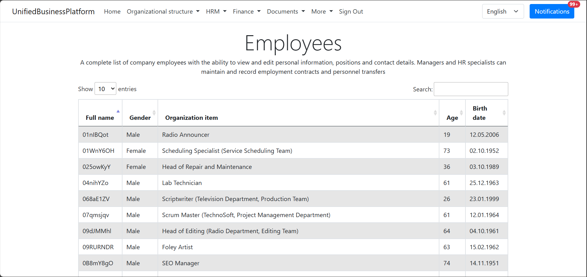

# velocipede-utils 

[English](README.md) | [Русский](README.ru.md)

This project is a centralized library that provides a wide range of functions: reusable data models, services, and extensions that are designed to simplify and speed up the development of business applications, particularly in the areas of ERP and CRM.

## Idea

This library was created to solve the problem of code duplication and disparate object models when developing business applications. For example, I often had to create identical entities and services in different projects, which led to a loss of time and complicated support. It is worth noting that each project had its own repository, which complicated the integration between projects and the ability to change the object model.

As a result, it was decided to create a mono-repository, which included most of the previously created projects, as well as a common object model for representing data in the DB. This approach allows:
- Avoid code duplication.
- Ensure data consistency between projects.
- Reduce development time by reusing ready-made components.
- Simplify refactoring and dependency management.

## Projects

### Shared

List of the shared projects (reusable data models, services, and extensions):

- [CodeExtensions](VelocipedeUtils/Shared/src/CodeExtensions/README.md)
- [Communication](VelocipedeUtils/Shared/src/Communication/README.md)
- [DbOperations](VelocipedeUtils/Shared/src/DbOperations/README.md): unified operations with relational databases, simplifying the extraction and insertion of data from disparate sources.
- [Models](VelocipedeUtils/Shared/src/Models/README.md)
- [Models.Business](VelocipedeUtils/Shared/src/Models.Business/README.md): is an implementation of a shared object model for business entities used within the mono-repository.
- [Office](VelocipedeUtils/Shared/src/Office/README.md): library for working with office document formats.
- [Office.Extensions](VelocipedeUtils/Shared/src/Office.Extensions/README.md): extension library for working with office document formats.
- [ServiceDiscoveryBpm](VelocipedeUtils/Shared/src/ServiceDiscoveryBpm/README.md)
- [WpfExtensions](VelocipedeUtils/Shared/src/WpfExtensions/README.md): is a library of visual elements for WPF applications.

### [PixelTerminalUI](VelocipedeUtils/PixelTerminalUI/README.md)

`PixelTerminalUI` was inspired by my experience working as a C# developer at a large IT company that operated a major online store of digital equipment. I worked in the WMS department, developing applications for internal logistics. One of the key applications was a legacy Telnet UI application used for interacting with handheld terminals (PDAs).

As the company sought to modernize its development practices with CI/CD, challenges arose in building and deploying .NET Framework 4.8 applications. So we started exploring the possibilities of moving our major projects to newer .NET versions (eg .NET 6/8) and I decided to take the Telnet UI application into my area of responsibility.

Intrigued by how this application achieved a full UI experience using simple characters, I decided to explore its inner workings. This led to the creation of `PixelTerminalUI`, a project aimed at reimagining the engine behind this Telnet UI application. It serves as a demonstration of how to create a character-based UI framework in modern .NET.

The Telnet UI application established a persistent connection between the client and the server, which could complicate the issue of scalability and performance of the service. So, as `PixelTerminalUI` evolved, I also decided to try to use a REST API instead of Telnet/TCP and improve the session management mechanism.

`PixelTerminalUI` is a completely independent project, developed in my free time and does not contain any code or confidential information from my previous employer.

Example of displaying information in a console application:

```
------------------------------------
                                    |
                                    |
                                    |
                                    |
             WELCOME TO             |
         PIXEL TERMINAL UI          |
                                    |
                                    |
                                    |
                                    |
                                    |
                                    |
                                    |
                                    |
....................................|
                                    |
                                    |
PRESS ENTER TO CONTINUE             |
------------------------------------
```

### [UnifiedBusinessPlatform](VelocipedeUtils/UnifiedBusinessPlatform/README.md)

This project is a web application on ASP.NET MVC, designed for company management (organizational structure, employee information, and automation of key HR processes).


Visualization of the hierarchical structure of the company: organizations, departments, teams, positions:


Employee information management:



Planned improvements:
- **Absence management**: A system for recording vacations, sick leaves, and other types of employee absences.
- **Payroll calculation**: Automatic calculation of wages based on hours worked and other factors.
- **Internal Documentation**: A tool for storing and managing internal company documents such as policies, procedures, instructions.
- **Knowledge Base**: Creating and maintaining a knowledge base for sharing experiences and information between employees.

### [DataStorage](VelocipedeUtils/DataStorage/README.md)

This project is designed to study and implement various types of data storage, as well as to study the principles of building distributed systems.

Project goal: in-depth understanding of the architecture, features and optimization methods of various data storages, from relational databases to key-value and key-attribute-value storages, both in-memory and persistent implementations.
