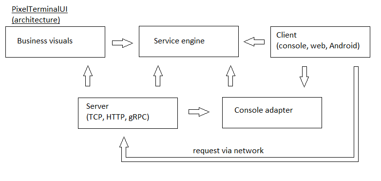

# PixelTerminalUI

[English](README.md) | [Русский](README.ru.md)

## Предыстория

`PixelTerminalUI` был вдохновлён моим опытом работы разработчиком на C# в крупной IT-компании, работавшей для крупного маркетплейса. Я работал в отделе WMS, разрабатывая приложения для внутренней логистики. Одним из ключевых приложений было устаревшее UI приложение, работавшее на Telnet, используемое для взаимодействия с терминалами сбора данных (ТСД).

По мере того, как компания стремилась модернизировать свои методы разработки с помощью CI/CD, возникли трудности со сборкой и развертыванием приложений .NET Framework 4.8. Поэтому мы начали исследовать возможности перевода наших основных проектов на новые версии .NET (например, .NET 6/8), и я решил взять Telnet UI приложение в свою зону ответственности.

Заинтересованный тем, как это приложение возволяло добиться полноценного пользовательского интерфейса с помощью простых символов, я решил изучить его внутреннюю работу. Это привело к созданию `PixelTerminalUI` - проекта, направленного на переосмысление движка этого Telnet UI приложения. Он служит демонстрацией того, как создать фреймворк с символьным интерфейсом в современном .NET.

В Telnet UI приложении устанавливалось постоянное соединение между клиентом и сервером, что могло усложнять вопрос масшабируемости и производительности сервиса. Поэтому по мере развития `PixelTerminalUI`, я также решил попробовать использовать REST API вместо Telnet/TCP и доработать механизм управления сессиями.

`PixelTerminalUI` - это полностью независимый проект, разработанный мной в свободное время, и он не содержит никакого кода или конфиденциальной информации от моего предыдущего работодателя.

## Примеры использования

Пример отображения информации в консольном приложении:

```
------------------------------------
                                    |
                                    |
                                    |
                                    |
             WELCOME TO             |
         PIXEL TERMINAL UI          |
                                    |
                                    |
                                    |
                                    |
                                    |
                                    |
                                    |
                                    |
....................................|
                                    |
                                    |
PRESS ENTER TO CONTINUE             |
------------------------------------
```

Прорисовка и обработка формы, а также её визуальных элементов/контролов, производится преимущественно на стороне сервера; клиентское приложение зачастую лишь отображает результат, полученный от сервера. Также при определении формы возможно реализовать методы для обработки пользовательского ввода (через делегат `EnterValidation`, наследуемый от базовой формы `BaseForm`).

Пример кода для формы:

```C#
public class frmStart : BaseForm
{
    private TextControl? lblWelcome;
    private TextControl? lblAppName;

    private TextEditControl? txtUserInput;

    public frmStart() : base()
    {
    }
    
    protected override void InitializeComponent()
    {
        Name = nameof(frmStart);
        
        lblWelcome = new TextControl();
        lblWelcome.Name = nameof(lblWelcome);
        lblWelcome.Top = 4;
        lblWelcome.Left = 0;
        lblWelcome.EntireLine = true;
        lblWelcome.HorizontalAlignment = HorizontalAlignment.Center;
        lblWelcome.Value = "WELCOME TO";
        Controls.Add(lblWelcome);

        lblAppName = new TextControl();
        lblAppName.Name = nameof(lblAppName);
        lblAppName.Top = 5;
        lblAppName.Left = 0;
        lblAppName.EntireLine = true;
        lblAppName.HorizontalAlignment = HorizontalAlignment.Center;
        lblAppName.Value = "PIXEL TERMINAL UI";
        Controls.Add(lblAppName);

        txtUserInput = new TextEditControl();
        txtUserInput.Name = nameof(txtUserInput);
        txtUserInput.Top = 14;
        txtUserInput.Left = 0;
        txtUserInput.EntireLine = true;
        txtUserInput.Hint = "PRESS ENTER TO CONTINUE";
        txtUserInput.EnterValidation = txtUserInput_EnterValidation;
        Controls.Add(txtUserInput);
    }

    private bool txtUserInput_EnterValidation()
    {
        try
        {
            switch (txtUserInput.Value)
            {
                case "":
                case "-n":
                    ShowForm(new frmLogin());
                    break;

                case "-q":
                case "-b":
                    ShowInformation("Are you sure to exit the application?");
                    break;
            }
        }
        finally
        {
            txtUserInput.Value = "";
        }
        return true;
    }
}
```

## Архитектура

Взаимодействие между модулями проекта:



Требования представлены по ссылке: [requirements](docs/requirements.ru.md)
