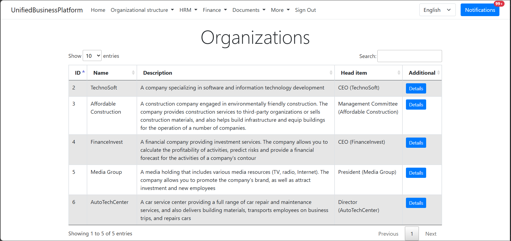

# UnifiedBusinessPlatform

[English](README.md) | [Русский](README.ru.md)

This project is a web application on ASP.NET MVC, designed for company management (organizational structure, employee information, and automation of key HR processes).

Visualization of the hierarchical structure of the company: organizations, departments, teams, positions:

Employee information management:

Planned improvements:
- **Absence management**: A system for recording vacations, sick leaves, and other types of employee absences.
- **Payroll calculation**: Automatic calculation of wages based on hours worked and other factors.
- **Internal Documentation**: A tool for storing and managing internal company documents such as policies, procedures, instructions.
- **Knowledge Base**: Creating and maintaining a knowledge base for sharing experiences and information between employees.

## Getting started

This project includes a utility (the console application [DbInit](VelocipedeUtils.UnifiedBusinessPlatform.DbInit)), which initializes the database so that the user has the impression that he is working with a full-fledged commercial application. This utility should be launched when starting work on the project.

### Object model

EF Core is used to work with the database, and for most of the application's functionality, the object model has already been implemented in [Models.Business](../Shared/Models.Business). If changes are necessary, it is better to stick to the **Code-first** approach, i.e. first change the class, and then migrate and apply it to the database.

Due to the fact that full use of this application is impossible with an empty database, at the very beginning there was a little confusion in the use of approaches to working with the database. First, the first migrations were performed based on models from `Models.Business`. Thus, the corresponding tables were created in the database, and then these tables were filled with data (mainly, data on the organizational structure of several companies at once).

Since there was a lot of data, the data was complicated, and the process of filling with data took a couple of weeks, the idea arose to perform a database dump in order to initialize the database with one script and save time. As a result of this decision, confusion arose between the approaches to working with the database and the object model: it became unclear what we were using - **Code-first** and **Database-first**. In order to stabilize the situation, it was decided to create the [DbInit](VelocipedeUtils.UnifiedBusinessPlatform.DbInit) utility for automatic database initialization.

Therefore, there is a recommendation: at the very beginning of working on an application, first use the [DbInit](VelocipedeUtils.UnifiedBusinessPlatform.DbInit) utility to initialize your database, and then continue working with objects within the **Code-first** approach.

Based on this, additional rules for making changes have emerged:

- When you have made changes to the object model or DB procedures, you must save all information about the changes in the version control system (including all EF Core migrations and SQL scripts).
- If a SQL script was created, you must add the path to the new SQL script to the end of the list of actions for initialization in [DbInit](VelocipedeUtils.UnifiedBusinessPlatform.DbInit). Otherwise, your changes will not be applied automatically, which may result in errors for users who will use your changes.
