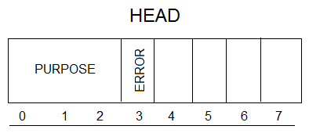

# Header 

**Header** should be common for **client** and **server**. 

There is several reasons why communication between **client** and **server** can be started, for example: 
- client **sent message** in the chat; 
- client **joined** the chat; 
- client **left** the chat; 
- client **makes request** to the server for getting messages; 
- ether *client* or *server* sent **error report**. 

So **header** is shown below: 



**PURPOSE** is responsible for what the client makes request to the server: 
- **CTC** (*Client-to-client*): `0`; 
- **AUTH** (*Authentication* when user connected to the chat): `1`; 
- **EXIT** (*Exit from the chat*): `2`; 
- **MSGRQST** (*Message request*): `3`; 
- **ERRMSG** (*Error message*): `4`. 

The **ERROR** bit is responsible for whether any error occurred during communication.

We can describe these bits using `Header` enumeration as follows: 
```C#
[Flags]
public enum Header
{
    // PURPOSE bits
    PURPOSE_CTC     =   0b00000000, 
    PURPOSE_AUTH    =   0b00100000,
    PURPOSE_EXIT    =   0b01000000, 
    PURPOSE_MSGRQST =   0b01100000, 
    PURPOSE_ERRMSG  =   0b10000000,

    // ERROR bits 
    ERROR_NO        =   0b00000000, 
    ERROR_YES       =   0b00010000
}
```
