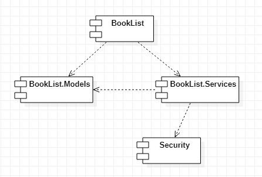
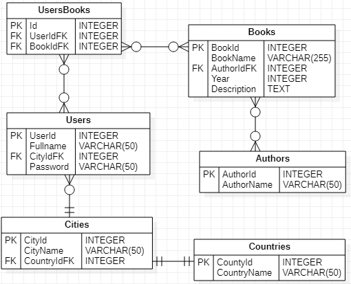

# BookList 

Application **BookList** is designed for creating and managing a table of *favorite books*. 
The app also incudes a simple *authentication system* for users. 


On the *Books page* you can manage the list of your favorite books: 


This app is written in `C#` using **ASP.NET Core** and **Razor Pages**. 

## How to use

### Prerequisites

- .NET Core 3.1;
- Any text editor (*VS Code*, *Sublime Text*, *Notepad++* etc) or *Visual Studio*;
- Command line or terminal (if you do not use *Visual Studio*).

### Dependencies 

- `Microsoft.Data.Sqlite` for SQLite Database;
- `xUnit` and `NUnit` for unit testing; 
- `Microsoft.Extensions.Logging` for logging; 
- `Microsoft.AspNetCore.Authentication.Cookies` for using cookies in authentication. 

### Launching this app 

In order to run this application, you need to type the following command into Windows command line: 
```
run.cmd
```

## Software Architecture 

This app consists of several projects such as: 
- **BookList**: consists of *Pages* (aka *Views*) and *ViewModels*; 
- **BookList.Models**: contains `Books` and `User` classes that are used for *Repository pattern* implementation; 
- **BookList.Services**: classes for *Repository pattern* implementation and interacting with *SQLite* database; 
- **Security**: classes for *hashing* and *substitution cipher*. 

### Overview 

This app consists of several projects such as: 
- **BookList**: consists of *Pages* (aka *Views*) and *ViewModels*; 
- **BookList.Models**: contains `Books` and `User` classes that are used for *Repository pattern* implementation; 
- **BookList.Services**: classes for *Repository pattern* implementation and interacting with *SQLite* database; 
- **Security**: classes for *hashing* and *substitution cipher*. 

**Component diagram** is shown below: 



### Database 

**ER diagram** can help you to understand what tables the *SQLite* database includes: 



*ER diagram* also allows to understand how `UserRepository` class (from **BookList.Services**) works with *SQLite* database. 
For example, if you need to add some new user into the DB, you might want to do some steps: 
1. Insert information about *country*; 
2. Insert information about *city*; 
3. insert information about *user*. 

In the code this can be represented the following way: 
```C#
namespace VelocipedeUtils.Examples.BookList.Services
{
    /// <summary>
    /// Class that allows users to interact with database 
    /// </summary>
    public class UserRepository : IUserRepository 
    {
        ...
        /// <summary>
        /// Creates the user if does not exist in the DB (SQL requests are used)
        /// </summary>
        /// <param name="fullname">String value of fullname of the user</param>
        /// <param name="country">String value of country of the user</param>
        /// <param name="city">String value of city of the user</param>
        /// <param name="password">String value of password of the user</param>
        public void CreateUser(string fullname, string country, string city, 
            string password)
        {
            ...
            // Requests for country information. 
            string insertCounty = $@"INSERT INTO Countries (CountryName) 
                SELECT ('{country}')
                WHERE (SELECT COUNT(1) FROM Countries WHERE CountryName = '{country}') = 0;"; 

            // Requests for city information. 
            string insertCity = $@"INSERT INTO Cities (CityName, CountryIdFK) 
                VALUES (
                    '{city}', 
                    (SELECT CountryId FROM Countries WHERE CountryName = '{country}')
                );";  
            string checkCity = $@"SELECT COUNT (1) FROM Cities 
                WHERE CityName = '{city}';"; 

            // Requests for user information. 
            string insertUser = $@"INSERT INTO Users (Fullname, CityIdFK, Password) 
                VALUES (
                    '{fullname}', 
                    (SELECT CityId FROM Cities WHERE CityName = '{city}'), 
                    '{password}'
                );";  
            string checkUser = $@"SELECT COUNT (1) FROM Users 
                WHERE Fullname = '{fullname}' AND Password = '{password}';"; 
            
            try
            {
                // Insert all data into database. 
                DbHelper.Insert(insertCounty); 
                DbHelper.Insert(insertCity, checkCity); 
                DbHelper.Insert(insertUser, checkUser); 
            }
            catch (System.Exception e)
            {
                throw e;
            }
        }
        ...
    }
}
```

If you want to insert a *book associated with a particular user*, just perform the similar steps. 
