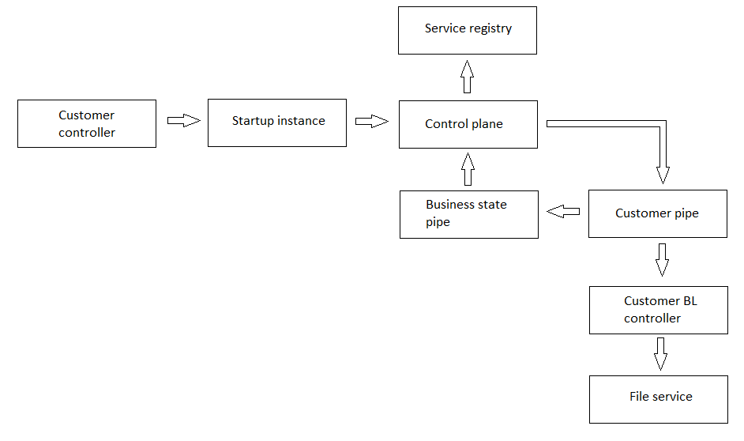

# ServiceInteraction

[English](README.md) | [Русский](README.ru.md)

There are several components that "communicate" with each other, as shown in the figure below.


Regarding communication between components, several points can be highlighted:
- The components communicate not directly, but through the [ServiceDiscoveryBpm](../../../VelocipedeUtils/Shared/src/ServiceDiscoveryBpm/README.md) library.
- Details of communication with the database are implemented on the side of the application that implements the business logic.

There are several types of client applications:
- monolith;
- HTTP;
- gRPC.

## Sequence of request processing on services

### Customer



## Project configuration

1. In the PostgreSQL database, create a database named `deliveryservicelibexample`.

2. Run the command to update the database based on the migrations.

```
dotnet ef database update --project BL/VelocipedeUtils.Examples.Delivering.ServiceInteraction.BL.csproj --startup-project InitializeDb/VelocipedeUtils.Examples.Delivering.ServiceInteraction.InitializeDb.csproj
```

3. Fill the database with test data: run the `InitializeDb` console application.

4. After successful execution of the `InitializeDb` console application, adjust the [Customer.MakeOrder.json](JsonRequestTemplates\Customer.MakeOrder.json) file: the `productIds` parameter should have record IDs that correspond to the first 3 products. This file is used to test the API when placing an order on the consumer side (for example, the [WebAPI customer](Webapi/customer/README.md) application).
