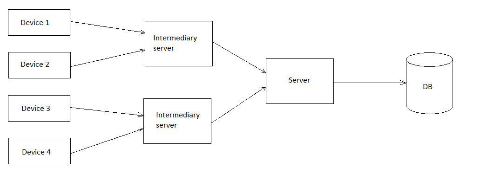

# Architecture 

[English](architecture.md) | [Русский](architecture.ru.md)

## Simple client-server approach

The most obvious and simplest solution for this project may be to use the simple client-server architecture, in which devices send HTTP requests to the server, which it processes and inserts into the database:

PostgreSQL is used as the database.

The main disadvantage of this approach is that one server cannot process too many requests at the same time (for our application, the limit is approximately 160-200 requests per second).
Since we need to process 20,000 requests per second, we need to deploy 100 to 125 application instances.

There are several ways to optimize this approach:

- Using a message broker to increase the number of processed requests per second;
- Use of intermediate servers (i.e. providing "clustering" of end devices);
- Saving data locally at the shell level above the device to reduce the number of requests to the server (for example, if you send 10 values in one request, you can reduce the number of network requests to the server by 10 times).

The above approaches can be used in combination with each other.

## Message queue architecture

An alternative solution would be to use a message broker (e.g. RabbitMQ), which would allow you to increase the number of requests processed per second:

## Intermediate servers

When using intermediate servers between the end devices and the main server, it is necessary to provide the so-called "clustering" end devices.
Those. it is possible to deploy an additional 100 staging server instances to reduce the load on the primary server.

Note that this approach is more reasonable to implement in conjunction with local data storage (and, accordingly, a decrease in the number of network requests).
Local storage can be provided both at the level of end devices and at the level of intermediate servers - this in turn will reduce the number of intermediate servers.
