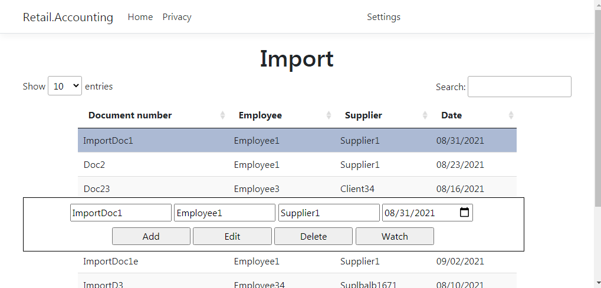

# Retail.Accounting

`Retail.Accounting` is written in **C#** using **ASP.NET Core**. 

You can insert information about your *purchases*. 



You can get and insert information about your *partners*. 


Also you can get individual statistics of your *employees* and statistics of *products* that you sold. 


## Prerequisits 

- .NET Core 3.1;
- Any text editor (VS Code, Sublime Text, Notepad++ etc) or Visual Studio;
- Command line or terminal (if you do not use Visual Studio).

## Dependencies 

- **EF Core**: for interacting with a database; 
- **plotly.js**: for displaying plots. 

## How to use 

### Updating a database 

Before you start the app, you need to create folder named `DB` in the main directory of the project, then update a database. 
```
dotnet ef migrations add InitialCreate --project Models\Models.csproj --context AccountingContext --startup-project UI\UI.csproj
dotnet ef database update --project Models\Models.csproj --context AccountingContext --startup-project UI\UI.csproj
```

Also you need to create file `MainCompany.xml` in the `DB` folder and as follows: 
```XML
<?xml version="1.0" encoding="utf-8"?>
<MainCompany>
  <CompanyName>The company name</CompanyName>
  <Owner>Name of the owner</Owner>
  <Country>Your country</Country>
  <City>Your city</City>
</MainCompany>
```
