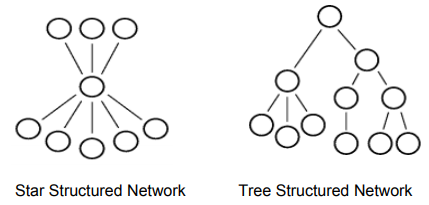
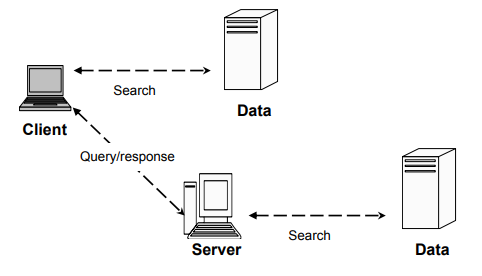

# Network 

## Topology  

Client-server application can be implemented using different topologies: **star topology** and **tree structured topology**. 

Using **star topology** we just implement one instance of *server side app* and one instance of *client side app*. 
*Client* can run on multiple computers, and *server* can only run on a single computer. 

**Tree structured topology** can be considered as an *advanced model*. 
For instance, it could be *hierarchically structured system* that consists of multiple servers and multiple clients. 
Or it could be one server and multiple clients where clients are both servers and clients (so they can have only one server and fixed amount of clients). 

In this project we are going to implement **star topology**. 

## Communication 

As we know, **communication between client and server** can be performed the following way: a client application sends messages to a server via the network to request the server for performing a specific task. 

In this project we can use databases both on client and server: *local database* stores information about the users on a particular computer for authentication, server-side database stores all information. 

Diagram that shows *request processing sequence* is presented below: 

