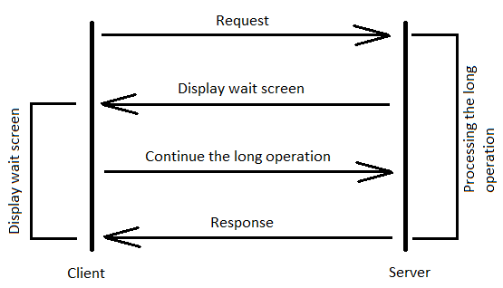

# Wait screen

Wait screen is needed to display the message "Please, wait" on the client side when performing long operations in `PixelTerminalUI`.

The sequence of request processing is as follows:

- The client sends a request to the server.
- The server starts a long operation and sends a Wait screen to the client.
- The client displays the Wait screen and makes a request to the server to resume the operation.
- The server resumes the operation from the point where the Wait screen was sent last time. After this, the request is processed as usual.



## Examples

When validating the control, the Wait screen call might look like this:

```C#
private bool txtValue1_EnterValidation()
{
    try
    {
        switch (txtValue1.Value)
        {
            case "":
            case "-n":
                txtValue1.Value = "";
                return false;

            case "-b":
                SessionInfo.CurrentForm = ParentForm;
                return true;

            default:
                // Show the wait screen.
                if (ShowWaitScreen())
                {
                    return true;
                }

                // Resume validation.
                SessionInfo.WaitScreenDisplayed = false;
                LongOperationMethod(txtValue1.Value);
                FocusedEditControl = txtValue2;
                return true;
        }
        return true;
    }
    catch (Exception ex)
    {
        ShowError(ex.Message);
        txtValue1.Value = "";
        return false;
    }
}

private void LongOperationMethod(string userInput)
{
    TestDao.ProcessUserInputInDb(userInput);
}
```
