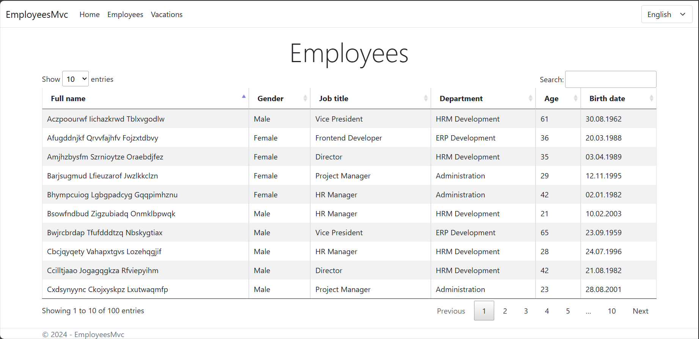
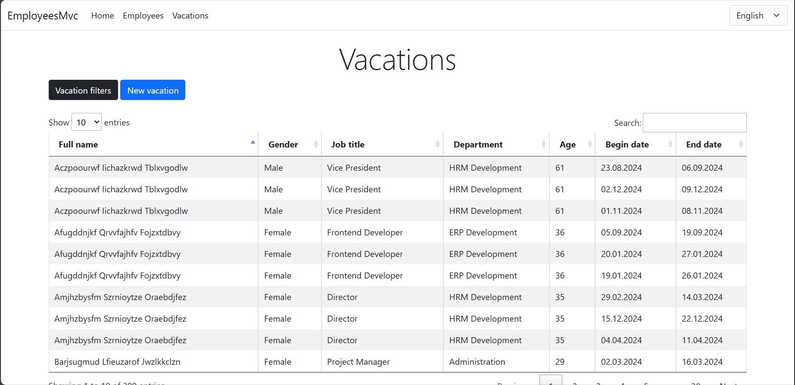

# UnifiedBusinessPlatform

[English](README.md) | [Русский](README.ru.md)

This project involves creating a software application that can efficiently handle the generation and management of employee vacation data, as well as provide insights into vacation crossings based on specific criteria.

## Requirements

1. Generate randomly "employees of the company": 100 user objects (full name, gender, position (listing 10 positions), age).
2. Randomly generate "vacation schedule": 3 "vacation" objects (start date, end date, user object) with a length of 14,7,7 days for each created user in the current year.
3. Request the entry of a "new vacation" for the current employee. The length of the new vacation is not more than 14 days.
4. Display information about vacation crossings according to the criteria:
    - Crossing vacations with employees of my department. Employees under 30 years of age.
    - Absense crossing with female employees not from my department. Age of employees - over 30, but under 50.
    - Absense crossing with employees from any department. Employees are over 50 years old.
    - Vacations without crossing.
5. It is desirable to use LINQ, lambda expressions.
6. It is desirable to choose the most efficient algorithm for determining intersections.

## Getting started

This project includes a utility (the console application [DbInit](WorkflowLib.UnifiedBusinessPlatform.DbInit)), which initializes the database so that the user has the impression that he is working with a full-fledged commercial application. This utility should be launched when starting work on the project.

### Object model

EF Core is used to work with the database, and for most of the application's functionality, the object model has already been implemented in [Models.Business](../Shared/Models.Business). If changes are necessary, it is better to stick to the **Code-first** approach, i.e. first change the class, and then migrate and apply it to the database.

Due to the fact that full use of this application is impossible with an empty database, at the very beginning there was a little confusion in the use of approaches to working with the database. First, the first migrations were performed based on models from `Models.Business`. Thus, the corresponding tables were created in the database, and then these tables were filled with data (mainly, data on the organizational structure of several companies at once).

Since there was a lot of data, the data was complicated, and the process of filling with data took a couple of weeks, the idea arose to perform a database dump in order to initialize the database with one script and save time. As a result of this decision, confusion arose between the approaches to working with the database and the object model: it became unclear what we were using - **Code-first** and **Database-first**. In order to stabilize the situation, it was decided to create the [DbInit](WorkflowLib.UnifiedBusinessPlatform.DbInit) utility for automatic database initialization.

Therefore, there is a recommendation: at the very beginning of working on an application, first use the [DbInit](WorkflowLib.UnifiedBusinessPlatform.DbInit) utility to initialize your database, and then continue working with objects within the **Code-first** approach.

Based on this, additional rules for making changes have emerged:

- When you have made changes to the object model or DB procedures, you must save all information about the changes in the version control system (including all EF Core migrations and SQL scripts).
- If a SQL script was created, you must add the path to the new SQL script to the end of the list of actions for initialization in [DbInit](WorkflowLib.UnifiedBusinessPlatform.DbInit). Otherwise, your changes will not be applied automatically, which may result in errors for users who will use your changes.

## Using the application

Employees:

Vacations:

